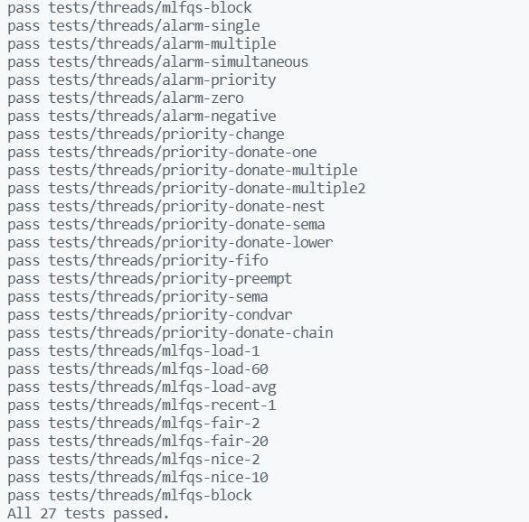

**CSED312 OS Lab 2 - User program**
================

**Final Report**
----------------

<div style="text-align: right"> 20180085 송수민 20180373 김현지 </div>

------------------------------

# **I. Implementation of Argument Passing**

## **Analysis**

현재 pintOS의 Argument Passing은 구현되어 있지 않다. pintos –q run ‘echo x’ 라는 명령어를 입력하면 ‘echo x’라는 argument들을 메모리에 쌓아 process가 이를 활용할 수 있도록 해야하는데, 이러한 기능이 구현되어 있지 않은 것이다. 궁극적으로, 이번 Implementation of Argument Passing은 문자열로 들어온 total argument들을 공백을 기준으로 구분해서 메모리에 쌓는 것을 목적으로 한다. 

## Brief Algorithm

- Process_execute()가 실행되면 file_name의 첫 부분(token이라 명명)을 thread_create에 첫번째 인자로 넘긴다. 
- Start_process에서 load를 호출한다. 이때, load의 첫번째 parameter를 file_name의 첫번째 token을 넘긴다.
- Load()가 success를 return하면 putArguments(file_name,&if_.esp)를 호출하여 메모리에 argument, address of argument, return address를 넣는다.


## Implementation

- process_execute() 변경 사항이다.
  
```cpp
tid_t process_execute (const char *file_name) 
{ 
...
  char *fn_copy_2 = palloc_get_page(0);
  strlcpy(fn_copy_2,file_name,PGSIZE);
  char *name;
  char *remain;
  name = strtok_r(fn_copy_2," ",&remain);
  /* Create a new thread to execute FILE_NAME. */

  tid = thread_create (name, PRI_DEFAULT, start_process, fn_copy);
  palloc_free_page(fn_copy_2);
...
}
```
> thread_create()를 호출 할 때 기존에는 file_name 전체를 parameter로 넘겼다. 이는 후에 exit system call 시에 name을 불러오는데 잘못된 name을 불러오기 때문에 변경하여야 한다. 변경방법은 직접적으로 file_name을 접근하지 못하게 하기 위해 fn_copy_2를 새로 동적할당하여 file_name을 복사하고 이를 strtok_r을 이용하여 문자열을 잘라 첫 부분만 thread_create에 넘긴다. 이후, OS는 효율적인 메모리 관리가 중요하므로 필요없는 fn_copy_2를 해제한다.

- process_start() 변경 사항이다.

```cpp
static void start_process (void *file_name_)
{
...
  char* fn_copy_1 = palloc_get_page(0);
  char* cmd_name;
  char *remain;
  strlcpy(fn_copy_1,file_name,PGSIZE);
  cmd_name = strtok_r(fn_copy_1," ",&remain);
  /* Initialize interrupt frame and load executable. */
  memset (&if_, 0, sizeof if_);
  if_.gs = if_.fs = if_.es = if_.ds = if_.ss = SEL_UDSEG;
  if_.cs = SEL_UCSEG;
  if_.eflags = FLAG_IF | FLAG_MBS;
  success = load (cmd_name, &if_.eip, &if_.esp);
  //printf("value of success : %d\n",success);
  if(success){
    construct_esp(file_name, &if_.esp);
  }
  //printf("Checking Memory\n");
  //hex_dump(if_.esp, if_.esp, PHYS_BASE - if_.esp,true);
  palloc_free_page(fn_copy_1);
}
```
> process_execute()의 변경사항과 동일하다. load에서 프로그램 명으로 disk에서 file을 open하기 때문에, 'echo x'에서 'echo'만을 넘겨주어야 한다. 동일한 방법으로 load 첫번째 인자에 cmd_name을 넘겨준다. 이후, load가 true를 return하면 성공적으로 load되었다는 것이므로 construct_esp()를 호출하여 Stack에 argument를 쌓아준다. 이때 넘기는 parameter는 전체 file_name과 esp이다. construct_esp()가 종료되면 fn_copy_1을 해제한다.

- construct_esp()의 구현이다.
  
```cpp
void construct_esp(char *file_name, void **esp) 
{
  char ** argv;
  int argc;
  int total_len;
  char stored_file_name[256];
  char *token;
  char *last;
  int i;
  int len;
  
  strlcpy(stored_file_name, file_name, strlen(file_name) + 1);
  token = strtok_r(stored_file_name, " ", &last);
  argc = 0;
  /* calculate argc */
  while (token != NULL) 
  {
    argc += 1;
    token = strtok_r(NULL, " ", &last);
  }
  argv = (char **)malloc(sizeof(char *) * argc);
  /* store argv */
  strlcpy(stored_file_name, file_name, strlen(file_name) + 1);
  for (i = 0, token = strtok_r(stored_file_name, " ", &last); i < argc; i++, token = strtok_r(NULL, " ", &last)) {
    len = strlen(token);
    argv[i] = token;
  }
  /* push argv[argc-1] ~ argv[0] */
  total_len = 0;
  for (i = argc - 1; 0 <= i; i --) 
  {
    len = strlen(argv[i]);
    *esp -= len + 1;
    total_len += len + 1;
    strlcpy(*esp, argv[i], len + 1);
    argv[i] = *esp;
  }
  /* push word align */
  *esp -= total_len % 4 != 0 ? 4 - (total_len % 4) : 0;
  /* push NULL */
  *esp -= 4;
  **(uint32_t **)esp = 0;
  /* push address of argv[argc-1] ~ argv[0] */
  for (i = argc - 1; 0 <= i; i--) 
  {
    *esp -= 4;
    **(uint32_t **)esp = argv[i];
  }
  /* push address of argv */
  *esp -= 4;
  **(uint32_t **)esp = *esp + 4;
  /* push argc */
  *esp -= 4;
  **(uint32_t **)esp = argc;
  /* push return address */
  *esp -= 4;
  **(uint32_t **)esp = 0;
  free(argv);
}
```
> 메모리에 argument를 쌓는 전체적인 과정은 esp를 직접 조작하여 쌓는다. Stack은 위에서 아래로 자라나므로, -연산을 이용하여 조작한다. Stored_file_name은 file_name을 이용하여 직접 token을 조작하면 원본이 바뀔 수 있기 때문에 만든 일종의 temp value이다. Size를 256으로 고정한 이유는 pintos document에서 256보다 큰 argument는 들어올 수 없다고 제한을 걸어놓았고, 이를 이용해도 된다는 글에서 착안했다. 
> 먼저, strlcpy를 통해 복사를 하여 argument의 숫자부터 count한다. 이후 argc를 이용하여 argv를 argc만큼 동적할당한다. 다시 strlcpy를 통해 token을 잘라 이번엔 argv[i]에 해당 argument를 넣는다. 이 argv를 이용하여 stack에 쌓는다. 현재 esp는 setup_stack의 초기화로 인해 PHYS_BASE이며 아래로 자라나기 때문에 가장 마지막 argument부터 차례로 넣어준다. for문에서 argc-1가 initial value인 이유이다. 
> 4의 배수에 맞게 word alignment를 실행한 이후 다시 argv[i]의 address를 차례로 넣어준다. Argv의 address를 넣고 argc, fake return address까지 넣어준 후 argv를 해제해준다.
```cpp
bfffffe0  00 00 00 00 02 00 00 00-ec ff ff bf f9 ff ff bf |................|
bffffff0  fe ff ff bf 00 00 00 00-00 65 63 68 6f 00 78 00 |.........echo.x.|
```
- 위는 hex_dump(if_.esp, if_.esp, PHYS_BASE – if_.esp, true)를 실행한 결과이다. 알맞게 stack에 쌓인 것을 확인 할 수 있다.
  ★★★★★★★★★★★★★construct_esp 고치고 다시 수정 필요 ★★★★★★★★★★★★★★★★


</br></br></br></br></br></br></br></br></br></br></br></br>
</br></br></br></br></br></br></br></br></br></br></br></br>

# **II. Implementation of System Calls & Process Termination Messages**

## **Analysis**

> 현재 pintOS에는 System call을 발생시키는 도구는 구현이 되어있지만, System call이 발생해서 각각의 수행해야 하는 기능은 구현되어 있지 않다. 현재 구현되어 있는 사항은 각 System call의 Number와 Argument 개수에 따른 System call의 Macro 뿐이다. 
```cpp
/**/
/* Invokes syscall NUMBER, passing argument ARG0, and returns the
   return value as an `int'. */
#define syscall1(NUMBER, ARG0)                                           \
        ({                                                               \
          int retval;                                                    \
          asm volatile                                                   \
            ("pushl %[arg0]; pushl %[number]; int $0x30; addl $8, %%esp" \
               : "=a" (retval)                                           \
               : [number] "i" (NUMBER),                                  \
                 [arg0] "g" (ARG0)                                       \
               : "memory");                                              \
          retval;                                                        \
        })

/*userprog/syscall.c*/
static void
syscall_handler (struct intr_frame *f UNUSED) 
{
  printf ("system call!\n");
  thread_exit ();
}
```cpp

> 이를 이용해서 기능을 구현해야 한다. Syscall macro를 통해 User stack에 push된 System call Argument들에 대한 정보를 통해 System call을 수행한다. 이때 stack에 입력된 정보들을 읽기 위해 stack pointer를 통해 Argument를 pop하고, 해당 System call number에 대한 기능을 수행하는 과정을 구현하여야한다.

</br></br></br></br></br></br></br></br>

## **Implementation**

- thread에 새로운 변수들을 추가하였다.
```cpp
/*threads/thread.h*/
struct thread
{
    ... 
    #ifdef USERPROG
        /* Owned by userprog/process.c. */
        uint32_t *pagedir;                  /* Page directory. */

        struct thread *parent; /* 부모 process의 descriptor */
        struct list_elem child_elem; /* child 리스트 element */
        struct list child_list;/* child 리스트 */
        bool isLoad;/* process의 프로그램 메모리 load 유무 */
        bool isExit;/* process가 종료 유무 확인 */
        struct semaphore sema_exit;/* exit 세마포어 */
        struct semaphore sema_load;/* load 세마포어 */
        int exit_status;/* exit 호출 시 종료 status */

        struct file **fd_table; /* file descriptor 테이블 */
        int fd_nxt;             /* 현재 테이블에 존재하는 fd값의 최대값 + 1 */

        struct file *file_run;   /* 현재 실행중인 file 추가 */
    #endif
    ...
};

/*threads/thread.c*/
tid_t
thread_create (const char *name, int priority,
               thread_func *function, void *aux) 
{
  ...

  #ifdef USERPROG
    t->parent = thread_current(); /* 부모 process 저장 */
    sema_init(&(t->sema_exit), 0); /* exit 세마포어 0으로 초기화 */
    sema_init(&(t->sema_load), 0); /* load 세마포어 0으로 초기화 */
    t->isExit = false; /* process가 종료되지 않음 */
    t->isLoad = false; /* 프로그램이 로드되지 않음 */
    list_push_back(&(running_thread()->child_list), &(t->child_elem));/* child 리스트에 추가 */

    t->fd_nxt = 2;/* fd 값 초기화(0,1은 표준 입력,출력) */
    t->fd_table = palloc_get_page(PAL_ZERO); /* File Descriptor 테이블에 메모리 할당 */
    if(t->fd_table == NULL) return TID_ERROR;
  #endif
  ...
}
```
> parent : 현재 생성된 Process는 thread_create를 호출 한 thread_current()가 부모 process이다. 따라서, 생성된 Process의 부모를 담고 있는 member variable이다.</br>
> child_elem : thread를 다루는 방식과 동일하게, child thread들을 관리하기 위해 넣은 member이다. </br>
> child_list : thread를 다루는 방식과 동일하게, child thread들을 담고 있는 member이다.</br>
> isLoad : .</br>
> isExit:  </br>
> sema_exit : wait <-> exit 과정 중 process의 synchronization을 맞추기 위한 semaphore이다.  </br>
> sema_load : execute <-> start <-> load 과정 중 process의 synchronization을 맞추기 위한 semaphore이다.</br>
> exit_status : Parent Process가 Child Process의 종료가 어떠한 방식으로 종료되었는지 알기 위해 exit status를 담는 variable이다. 이를 바탕으로 synchornization, process termiantion message 등을 처리한다.  </br>

> fd_table : </br>
> fd_nxt: </br>
> file_run : </br>

### **Syscall Handler**
- syscall handler에 필요한 함수들을 구현하였다.
```cpp
bool check_address(void *addr)
{
  if(is_user_vaddr(addr)) return true;
  else return false;
}
```
> 주소 값이 user 영역에서 사용하는 address 값인지 확인하는 함수이다. 즉, 유효한 주소인지 threads/vaddr.h의 is_user_vaddr함수를 사용하여 확인한 후 그 결과를 return한다.
```cpp
void get_argument(void *esp, int *arg, int count){
  int i;
  for(i = 0; i < count; i++){
    if(!check_address(esp + 4*i)) exit(-1);
    arg[i] = *(int *)(esp + 4*i);
  }
}
```
> user stack에 있는 인자들을 kernel에 저장하는 함수이다. argument를 esp에서 pop하여 arg에 저장한다. system call마다 요구하는 개수가 달라 이를 syscall handler에서 count값을 지정하여 호출하고, 이를 통해 저장된 값을 이용하여 system call을 수행한다.

</br></br>

- 위의 함수들을 이용하여 syscall handler를 구현하였다.

```cpp
static void
syscall_handler (struct intr_frame *f ) 
{
  int argv[3];
  if (!check_address(f->esp)) exit(-1);

  switch (*(uint32_t *)(f->esp)) {
    case SYS_HALT: halt();
      break;
    case SYS_EXIT: 
      get_argument(f->esp + 4, &argv[0], 1);
      exit((int)argv[0]);
      break;
    case SYS_EXEC:
      get_argument(f->esp + 4, &argv[0], 1);
      f->eax = exec((const char*)argv[0]);
      break;
    case SYS_WAIT:
      get_argument(f->esp + 4, &argv[0], 1);
      f->eax = wait((pid_t)argv[0]);
      break;
    case SYS_CREATE:
      get_argument(f->esp + 4, &argv[0], 2);
      f->eax = create((const char*)argv[0], (unsigned)argv[1]);
      break;
    case SYS_REMOVE:
      get_argument(f->esp + 4, &argv[0], 1);
	  f->eax=remove((const char *)argv[0]);
      break;
    case SYS_OPEN:
      get_argument(f->esp + 4, &argv[0], 1);
      f->eax = open((const char *)argv[0]);
      break;
    case SYS_FILESIZE:
      get_argument(f->esp + 4, &argv[0], 1);
	  f->eax = filesize(argv[0]);
      break;
    case SYS_READ:
      get_argument(f->esp + 4, &argv[0], 3);
      f->eax = read((int)argv[0], (void*)argv[1], (unsigned)argv[2]);
      break;
    case SYS_WRITE:
      get_argument(f->esp + 4, &argv[0], 3);
      f->eax = write((int)argv[0], (const void*)argv[1], (unsigned)argv[2]);
      break;
    case SYS_SEEK:
      get_argument(f->esp + 4, &argv[0], 2);
	  seek(argv[0],(unsigned)argv[1]);
      break;
    case SYS_TELL:
      get_argument(f->esp + 4, &argv[0], 1);
	  f->eax = tell(argv[0]);
      break;
    case SYS_CLOSE:
      get_argument(f->esp + 4, &argv[0], 1);
	  close(argv[0]);
      break;
    default :
      exit(-1);
  }
```
> 각각의 syscall number에 맞게 switch문을 통해 syscall을 수행하도록 구현하였고, 주어진 number가 아닐 경우 exit(-1)을 호출하였다. system call마다 요구하는 argument를 get_argument 함수를 이용하여 stack에서 pop하고, return할 값이 있을 경우 stack에 다시 push하였다. 각각의 system call에 대한 부분은 아래에서 자세히 알아보도록 하자.

#### **halt**
```cpp
void
halt (void) 
{
  shutdown_power_off(); /* shutdown_power_off()를 사용하여 pintos 종료 */
}
```
> pintos를 종료시키는 System Call이다. shutdown_power_off()를 이용하여 종료시킨다.

#### **exit**
```cpp
void
exit (int status) {
  printf("%s: exit(%d)\n", thread_name(), status);  /* process 종료 메시지 출력, 출력 양식: “process name: exit status” */
  thread_current()->exit_status = status;   
  thread_exit ();   /* thread 종료 */
}
```
> 현재 process를 종료시키는 System Call이다. Process Termination Message를 출력하고, 해당 thread의 종료시 status를 저장하는 exit_status에 status를 저장한 후 thread를 종료한다. </br>
> Process Termination Message는 “process name: exit(status)”의 형태로 출력한다.

```cpp
/*threads/thread.c*/
void
thread_exit (void) 
{
  ...
  #ifdef USERPROG
    process_exit ();
  #endif
  ...
  thread_current()->isExit = true; /* process descriptor에 process 종료를 알림 */
  if(thread_current() != initial_thread){
	  sema_up(&(thread_current()->sema_exit)); /* 부모 process의 대기 상태 이탈 */
  }
  ...
}
```
> thread_exit()에서는 process_exit()를 통해 process를 종료시킨다. wait()에서 parent process는 child가 종료될 때까지 대기하게 되는데, 이때 sema_down해 뒀던 sema_exit이라는 semaphore를 sema_up하면서 대기하고 있던 부모 process에 child의 종료를 알린다.

#### **exec**
```cpp
pid_t
exec (const char *file)
{
  struct thread *child;
	pid_t pid = process_execute(file);  /* process_execute() 함수를 호출하여 child process 생성 */
  if(pid == -1)  return -1;
	child = get_child_process(pid); /* 생성된 child process의 process descriptor를 검색 */
  sema_down(&(child->sema_load));   /* child process의 프로그램이 load될 때까지 대기 */   
	if(child->isLoad) return pid;   /* 프로그램 load 성공 시 child process의 pid 리턴 */ 
	else		return -1;          /* 프로그램 load 실패 시 -1 리턴 */

}
```
> child process를 생성하고 프로그램을 실행시키는 System Call이다. userprog/process.c의 process_execute()를 통해 child process를 생성하고, sema_load라는 semaphore를 이용하여 child process의 응용 프로그램이 load 될 때까지 대기한다. </br>
> 프로그램 load 성공 시 생성된 process의 pid 값을 return, 실패 시 -1을 return한다.

#### **wait**
```cpp
int
wait (pid_t pid)
{
  return process_wait(pid); /* process_wait() 사용하여, child process가 종료 될 때까지 대기 */
}
```
> child process가 모두 종료될 때까지 대기하는 System Call이다. userprog/process.c의 process_wait()를 통해 child_process의 종료까지 대기한다.

```cpp
/*userprog/process.c*/
int
process_wait (tid_t child_tid) 
{
  struct thread *parent = thread_current();
  struct thread *child;
  
  int status;
  struct list_elem *e;
  if (!(child = get_child_process(child_tid))) return -1;
  for(e = list_begin(&parent->child_list);e!=list_end(&parent->child_list);e=list_next(e))
  {
    child = list_entry(e,struct thread, child_elem);
    if(child_tid == child->tid)
    {
      sema_down(&child->sema_exit);
      status = child->exit_status;
      remove_child_process(child);

      return status;
    }
  }
  return -1;
}
```
> TODO

#### **create**
```cpp
bool
create (const char *file, unsigned initial_size)
{
  if(file == NULL) exit(-1);    
  return filesys_create(file, initial_size); /* file 이름과 크기에 해당하는 file 생성 및 성공 여부 return */
}
```
> file을 생성하는 System Call이다. 생성할 file의 이름과 크기에 대한 정보를 통해 filesys/filesys.c의 filesys_create함수를 이용하여 file을 생성하고, 성공 여부를 return한다. file이 null일 경우 exit을 통해 process를 종료한다.

#### **remove**
```cpp
bool
remove (const char *file)
{
  return filesys_remove(file);  /* file 이름에 해당하는 file을 제거 및 성공 여부 return*/
}
```
> file을 삭제하는 System Call이다. 삭제할 file에 대한 정보를 통해 filesys/filesys.c의 filesys_remove함수를 이용하여 file을 삭제하고, 성공여부를 return한다.


#### **open**
```cpp
int
open (const char *file)
{
  int fd;
	struct file *f;

  if (file == NULL) exit(-1);

  lock_acquire(&lock_file); 
  f = filesys_open(file); /* file을 open */
  if (strcmp(thread_current()->name, file) == 0) file_deny_write(f);  /*ROX TEST*/
  
	if(f != NULL) { 
		fd = process_add_file(f);     /* 해당 file 객체에 file descriptor 부여 */
    lock_release(&lock_file);
		return fd;                        /* file descriptor 리턴 */
	}
  lock_release(&lock_file);
	return -1; /* 해당 file이 존재하지 않으면 -1 리턴 */
}
```
> TODO

```cpp
int process_add_file (struct file *f)
{
  int fd = thread_current()->fd_nxt;

  thread_current()->fd_table[fd] = f; /* 파일 객체를 파일 디스크립터 테이블에 추가*/
  thread_current()->fd_nxt++; /* 파일 디스크립터의 최대값 1 증가 */

  return fd;  /* 파일 디스크립터 리턴 */
}
```
> TODO

#### **filesize**
```cpp
int
filesize (int fd) 
{
	struct file *f;
	if((f = process_get_file(fd))) { /* file descriptor를 이용하여 file 객체 검색 */
		return file_length(f); /* 해당 file의 길이를 리턴 */
	}
	return -1;  /* 해당 file이 존재하지 않으면 -1 리턴 */
}

```
> TODO : 설명

```
struct file *process_get_file(int fd)
{
  struct file *f;

  if(fd < thread_current()->fd_nxt) {
		f = thread_current()->fd_table[fd]; /* 파일 디스크립터에 해당하는 파일 객체를 리턴 */
		return f;
	}
	return NULL; /* 없을 시 NULL 리턴 */
}
```
> TODO : 설명

#### **read**
```cpp
int
read (int fd, void *buffer, unsigned size)
{
  int read_size = 0;
	struct file *f;
  if(!check_address(buffer))
    exit(-1);
    
	lock_acquire(&lock_file); /* file에 동시 접근이 일어날 수 있으므로 Lock 사용 */

	if(fd == 0) {   /* file descriptor가 0일 경우(STDIN) 키보드에 입력을 버퍼에 저장 후 버퍼의 저장한 크기를 리턴 (input_getc() 이용) */
    unsigned int i;
    for(i = 0; i < size; i++) {
       if (((char *)buffer)[i] == '\0') break;
    }
    read_size = i;
	} else {
		if((f = process_get_file(fd))) 
      read_size = file_read(f,buffer,size);  /* file descriptor가 0이 아닐 경우 file의 데이터를 크기만큼 저장 후 읽은 바이트 수를 리턴 */
	}

	lock_release(&lock_file); /* file에 동시 접근이 일어날 수 있으므로 Lock 사용 */

	return read_size;
}
```
> TODO

#### **write**
```cpp
int
write (int fd, const void *buffer, unsigned size)
{
  int write_size = 0;
	struct file *f;

	lock_acquire(&lock_file); /* file에 동시 접근이 일어날 수 있으므로 Lock 사용 */

	if(fd == 1) { /* file descriptor가 1일 경우(STDOUT) 버퍼에 저장된 값을 화면에 출력후 버퍼의 크기 리턴 (putbuf() 이용) */
		putbuf(buffer, size);
		write_size = size;
	} else {    /* file descriptor가 1이 아닐 경우 버퍼에 저장된 데이터를 크기만큼 file에 기록후 기록한 바이트 수를 리턴 */
		if((f = process_get_file(fd)))
			write_size = file_write(f,(const void *)buffer, size);
	}

	lock_release(&lock_file); /* file에 동시 접근이 일어날 수 있으므로 Lock 사용 */

	return write_size;
}
```
> TODO

#### **seek**
```cpp
void
seek (int fd, unsigned position) 
{
  struct file *f = process_get_file(fd); /* file descriptor를 이용하여 file 객체 검색 */

	if(f != NULL) file_seek(f, position); /* 해당 열린 file의 위치(offset)를 position만큼 이동 */
}

```
> TODO

#### **tell**
```cpp
unsigned
tell (int fd) 
{
  struct file *f = process_get_file(fd); /* file descriptor를 이용하여 file 객체 검색 */

	if(f != NULL) return file_tell(f); /* 해당 열린 file의 위치를 반환 */
  return 0; 
}
```
> TODO

#### **close**
```cpp
void
close (int fd)
{
  process_close_file(fd);
}
```
> TODO

```cpp
void process_close_file(int fd)
{
	struct file *f;

	if((f = process_get_file(fd))) {  /* 파일 디스크립터에 해당하는 파일을 닫음 */
		file_close(f);
		thread_current()->fd_table[fd] = NULL;  /* 파일 디스크립터 테이블 해당 엔트리 초기화 */
	}
}
```
>

이렇게 Syscall Handler를 완성하여 System Calls을 해결할 수 있다.

# **III. Implementation of Denying Write to Executables**

## **Analysis**

세 개의 thread가 있을 때, 각각의 thread의 priority를 비교하여 가장 높은 thread가 H, 다음이 M, 가장 작은 thread를 L이라 하자. 이때, H가 lock을 요청했을때 이에 대한 lock이 L의 소유일 경우 H가 L에게 점유를 넘겨주면 L보다 우선순위가 높은 M이 점유권을 먼저 선점하게 되어 M L H 순서로 thread가 마무리 되는데, 이렇게 되면  M이 H보다 우선순위가 낮음에도 불구하고 먼저 실행되는 문제가 생긴다. 이를 priority inversion라고 한다.

이를 해결하는 방법으로 priority donation이 있다. 이는 H가 자신이 가진 priority를 L에게 일시적으로 넘겨 동등한 priority조건에서 점유하도록하여, 위와 같은 문제가 생기지 않도록 하는 방법이다.
아래는 pintOS에서 제공하는 두 가지 donation과 관련된 문제이다.

## **Brief Algorithm**

초기 priority를 뜻하는 origin_priority 및 donation list, wait중인 lock에 대한 변수 등을 thread에 추가한다.
priority를 donate하는 함수와, 기존의 priority로 reset시키는 함수를 구현해야하며, lock_acquire될 때 조건에 따라 donation이 진행되고, lock_release될 때 reset이 진행되도록 한다. 이때 priority값 뿐만아니라 donation list, wait lock에 대한 값도 함께 수정해주어야한다.

</br></br></br></br></br></br></br></br></br></br></br></br></br>

## **Implementation**

- origin_priority 및 donation list, wait중인 lock에 대한 변수 등을 thread에 추가하고, 초기화하였다.

```cpp
//threads/thread.h
struct thread
{
    ...
   int origin_priority;             //donation이전의 기존 priority
   struct list donation_list;       //thread에 priority를 donate한 thread들의 list
   struct list_elem donation_elem;  //위 list를 관리하기 위한 element
   struct lock *wait_lock;          //이 lock이 release될 때까지 thread는 기다린다.
    ...
}
```

```cpp
//threads/thread.c
static void
init_thread (struct thread *t, const char *name, int priority)
{
  ...
  t->origin_priority = priority;
  list_init(&t->donation_list);
  t->wait_lock = NULL;
  ...
}
```

- priority를 donate하는 함수(donate_priority)와, 기존의 priority로 reset시키는 함수(reset_priority)를 구현하였다.


# **Discussion**
## 1. ROX TEST
> 위 Test를

```cpp
int
open (const char *file)
{
  int fd;
	struct file *f;

  if (file == NULL) exit(-1);

  lock_acquire(&lock_file); 
  f = filesys_open(file); /* 파일을 open */
  if (strcmp(thread_current()->name, file) == 0) file_deny_write(f);  /*ROX TEST*/
  
	if(f != NULL) { 
		fd = process_add_file(f);     /* 해당 파일 객체에 파일 디스크립터 부여 */
    lock_release(&lock_file);
		return fd;                        /* 파일 디스크립터 리턴 */
	}
  lock_release(&lock_file);
	return -1; /* 해당 파일이 존재하지 않으면 -1 리턴 */
}
```

> 위 코드가 수정 전의 timer interrupt method이다. Recent_cpu와 load_avg의 call 순서를 보면 막연히 공식 문서에 나온 순서대로 call을 한 것을 볼 수 있다. 그렇지만, 각각의 값에 대한 계산식을 생각해보면 load_avg를 먼저 call하여 계산을 진행하고 recent_cpu를 호출해야 올바르다고 할 수 있다. 그 이유는 recent_cpu의 계산값이 load_avg에 영향을 받기 때문이다. 반면, load_avg는 그렇지 않다. 이에 따라 다음과 같이 코드를 수정하였다. 그 결과 문제가 모두 해결되었다.

```cpp
if(!(ticks % TIMER_FREQ)){
    mlfqs_load_avg();  
    mlfqs_recent_cpu();          
}
```

## 2. Multi_oom Test
> Priority donation을 구현할 때 처음 작성시에는 set priority부분에서 priority에 새로운 값을 대입하였다. 구현하고자 하는 방향에는 origin_priority와 priority를 구분하였는데, priority를 reset하거나 set할 때 priority에 대입을 하다보니 priority donation 중에 일어난 priority와 값이 구분되지 않아 본래의 priority로 돌아가고자 할 때 문제가 생기는 현상이 발생하였다. 이에 대한 해결 방법으로, set 또는 reset 하는 priority는 origin_priority에 대입하고, 그 외 priority donation 등 좀더 포괄적으로 많은 기능을 수행하는 priority는 priority 변수에 대입하였다. 그 결과 문제는 해결되었다.

## 3. What We have Learned
> 이번 과제를 통해 thread들이 어떻게 제어되는지, 공유 자원에 대해서 어떻게 관리되어야 하고 그 방법은 무엇들이 있는지, 처음에 고안한 thread scheduling 정책 이외에 다른 정책으로는 어떠한 것들이 있는지에 대해 배우고 이를 코드로 구현해보았다. 구현 중 어려웠던 부분은 time 문제라고 생각한다. time을 thread들이 동시에 사용하기 때문에, 어떠한 작업이 진행되고 있을 때 다른 thread에서 일어나는 일들을 고려해야 하고, 그 일들로 인해 현재 running thread에게는 어떤 영향을 미치는지, 또한 예정되어 있던 일들이 어떻게 수정되어야 하는지를 고려하는 것이 상당히 까다로웠다. Discussion 1번도 같은 맥락이라고 생각한다. 결국 이 문제도 thread들이 CPU를 점유하고 있어야 할 Time이 틀렸기 때문에 발생했다고 생각한다. Operating System을 구현 할 때 Concurrency Issue가 상당히 중요하고 까다로운 문제라는 것을 배웠다.

<br>

# **Result**
서버에서 make check를 입력하여 나온 모든 test에 대한 결과값이다.



위와 같이 이번 PintO Project 2의 모든 test를 pass한 모습을 볼 수 있다.
