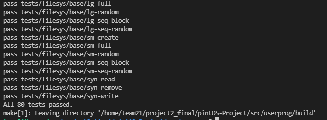

**CSED312 OS Lab 3 - Virtual Memory**
================

**Final Report**
----------------

<div style="text-align: right"> 20180085 송수민 20180373 김현지 </div>

------------------------------

# **I. Frame Table**
## **Analysis**
현재 pintos는 frame table에 대해 구현된 사항이 없다.

## **Brief Algorithm**
Frame을 효율적으로 관리하기 위해 필요한 virtual memory frame table을 구현해야한다. table의 각 entry는 user program의 page하나에 대응되고, 각각의 thread마다 frame table을 가지고 있어야한다. 각 table은 탐색이 빠른 hash로 구현하며, vaddr로 hash값을 추출한다. hash와 관련된 code는 src/lib/kernel/hash.*에 정의되어있어, 이를 사용하면 된다.

## **Implementation**

```cpp
/* vm/page.h */
struct vm_entry{
  uint8_t type; /* VM_BIN, VM_FILE, VM_ANON의 타입 */
  void *vaddr; /* virtual page number */
  bool writable; /* 해당 주소에 write 가능 여부 */
  bool is_loaded; /* physical memory의 load 여부를 알려주는 flag */
  struct file* file; /* mapping된 파일 */
  struct hash_elem elem; /* hash table element */

  size_t offset; /* read 할 파일 offset */
  size_t read_bytes; /* virtual page에 쓰여져 있는 데이터 byte 수 */
  size_t zero_bytes; /* 0으로 채울 남은 페이지의 byte 수 */
}
```

> frame table의 entry를 위와 같이 정의한다.
------------------------------

```cpp
/* threads/thread.h*/
struct thread {
  ...
  #ifdef USERPROG
    ...
    struct hash vm;     /* thread가 가진 virtual address space를 관리하는 hash table */
  #endif
  ...
}
```

> 각 thread마다 frame을 관리하는 table을 hash type으로 추가한다.
------------------------------

```cpp
/* vm/page.c */
void vm_init (struct hash *vm) {
  //hash_init() 함수를 이용하여 vm (hash table)을 init
}

//참고 /* hash.c */
bool hash_init (struct hash *h, hash_hash_func *hash, hash_less_func *less, void *aux)
```

> frame table을 초기화하는 함수를 추가한다
------------------------------

```cpp
/* vm/page.c */
void vm_destroy (struct hash *vm) {
  // hash_destroy() 함수를 이용하여 vm (hash table)을 destroy
}

//참고 /* hash.c */
void hash_destroy (struct hash *h, hash_action_func *destructor)
```

> frame table을 destroy하는 함수를 추가한다
------------------------------

```cpp
/* vm/page.c */
static unsigned vm_hash_func (const struct hash_elem *e, void *aux) {
  // element에 대한 vm_entry를 hash_entry() 함수를 이용하여 찾고, 
  // 해당 entry의 vaddr에 대한 hash key를 hash_int() 함수를 이용하여 구한 후 return
}
```

> element에 대한 hash key를 반환하는 함수를 추가한다 </br>
> vm_init에 필요하다
------------------------------

```cpp
/* vm/page.c */
static bool vm_less_func (const struct hash_elem *a, const struct hash_elem *b, void *aux) {
  // 두 element에 대한 vm_entry를 hash_entry() 함수를 이용하여 찾고, 각 entry의 vaddr을 비교
}
```
  
> 두 element에 대한 vm_entry의 vaddr값을 비교하는 함수를 추가한다 (a가 작으면 true, 크면 false return) </br>
> vm_init에 필요하다
------------------------------

```cpp
/* vm/page.c */
static void
vm_destroy_func(struct hash_elem *e, void *aux UNUSED)
{
  // element에 대한 hash_entry() 함수를 이용하여 찾고, vm_entry를 해당 entry를 free
}
```

> element에 대한 vm_entry를 free시키는 함수를 추가한다 </br>
> vm_destroy에 필요하다
------------------------------

```cpp
/* vm/page.c */
bool insert_vme(struct hash *vm, struct vm_entry *vme) {
  // hash_insert() 함수를 이용하여 vm (hash table)에 vme (entry)를 insert
}
```

> hash table에 vm_entry를 삽입하는 함수를 추가한다
------------------------------

```cpp
/* vm/page.c */
bool delete_vme(struct hash *vm, struct vm_entry *vme) {
  // hash_delete() 함수를 이용하여 vm (hash table)에서 vme (entry)를 delete
}
```

> hash table에서 vm_entry를 삭제하는 함수를 추가한다
------------------------------

```cpp
/* vm/page.c */
struct vm_entry *find_vme (void *vaddr) {
  // pg_round_down() 함수를 이용하여 vaddr의 page number를 구하고,
  // hash_elem을 hash_find() 함수를 이용해서 찾는다.
  // 해당 hash_elem에 대한 vm_entry 를 hash_entry()를 이용하여 구한 후 return */
}
```

> vaddr에 해당하는 hash_elem의 vm_entry를 찾아주는 함수를 추가한다
------------------------------

```cpp
/* userprog/process.c */
static void start_process (void *file_name_)
```

> process가 시작할 때, vm_init()를 호출하는 부분을 추가한다.
------------------------------

```cpp
/* userprog/process.c */
void process_exit (void)
```

> process가 종료될 때, vm_destroy()를 호출하는 부분을 추가한다.
------------------------------

</br>

# **II.Lazy Loading**
## **Analysis**
현재 pintos는 process execute에 필요한 Disk의 file에 대해 바로 physical memory에 page를 할당하여 load하고, page fault가 발생하면 error로 간주하여 program 실행을 중지한다. 사용하지 않는 data가 load될 경우, physical memeory를 차지하여 메모리가 낭비된다. 따라서 virtual memory의 page를 이용하여 필요한 data만 load되도록 구현하고, page fault handler도 수정해야한다.

## **Brief Algorithm**
처음에는 physical memory에 어떤 것도 load하지 않고, 각 file의 pointer 및 offset, size 등의 정보는 vm_entry에 저장한다. process execute를 통해 특정 virtual address에 접근할 때 physical page가 mapping되어 있지 않다면, page fault가 발생한다. page fault handler를 통해 접근이 시도된 vm_entry를 탐색한 후, vm_entry에 저장된 정보를 통해 data를 읽어 physical frame에 load하도록 구현한다.
또한, page fault handler에서 Lazy Loading(I/O가 필요)과 Wrong memory access(I/O가 필요X) 각각의 상황이 동시에 발생할 경우, 후자의 상황에 대해 먼저 처리하고 전자의 상황을 처리해야한다.

## **Implementation**

```cpp
/* userprog/process.c */
static bool load_segment (struct file *file, off_t ofs, uint8_t *upage, uint32_t read_bytes, uint32_t zero_bytes, bool writable) 
```

> load_segment는 segment를 process의 virtual address space에 load하는 함수이다. </br>
> 현재는 load_segment가 실행되면 page를 할당하고, file을 page에 load하고 process's address space에 page를 저장하도록 구현되어있다. </br>
> 이를 vm_entry를 할당하고 초기화 하며, vm (hash table)에 insert하도록 수정한다.
------------------------------

```cpp
/* userprog/process.c */
static bool setup_stack (void **esp) 
```

> setup_stack은 stack을 초기화하는 함수이다. </br>
> 현재는 page를 할당하고, install page함수를 통해 user virtual address UPAGE에서 kernel virtual address KPAGE로의 mapping을 page table에 추가한 후, esp를 설정하는 것까지 구현되어있다. </br>
> 이후에 vm_entry를 생성 및 초기화하고, vm (hash table)에 insert하는 부분을 추가한다.

</br>

# **III. Supplemental Page Table**

## **Analysis**
현재 pintos는 Lazy loading, file memory mapping, swap table이 정상적으로 작동하도록 하는 함수 구현이 전혀 되어있지 않다. Lazy loading, file memory mapping, swap table이 모두 잘 작동할 수 있도록 구현이 수정되어야한다.

## **Brief Algorithm**
현재 pintos는 page fault 발생시 처리를 위해 page_fault()라는 함수가 존재한다.
이는 I의 Analysis에서 명시하였듯, 무조건 “segmentation fault”를 발생시키고 kill(-1)을 하여 강제종료하도록 구현되어있다. 이를 vm_entry type에 맞게 처리되도록 수정한다.

## **Implementation**

```cpp
static void page_fault (struct intr_frame *f)
```

> find_vme를 이용하여 vm_entry를 찾은 후 해당 entry에 대해 page fault를 handle하는 함수를 호출한다.

------------------------------

```cpp
bool handle_mm_fault(struct vm_entry *vmentry)
```

> handle_mm_fault는 page fault시 이를 handle하기 위해 필요한 함수이다.
> page fault 발생시 palloc_get_page() 함수를 이용하여 physical page를 할당하고, switch문으로 vmentry type별로 처리한다.
> 이 단계에서는 일단 먼저 VM_BIN에 대해서만 구현하고, 다른 type에 대해서는 아래의 단계에서 추가로 구현한다.
> VM_BIN일 경우 load_file()함수를 이용해서 physical page에 Disk에 있는 file을 load한다.
> 각 타입에 대해 load가 완료되었으면, install_page() 함수를 이용하여 page table로 virtual address와 physical address를 mapping한 후 그 성공 여부를 반환한다.
------------------------------

```cpp
bool load_file (void* kaddr, struct vm_entry *vmentry)
```

> disk의 file을 physical memory로 load하는 함수이다.
> file_read()함수를 이용하여 physical page에 data를 load하고 남은 부분은 0으로 채운다.

</br>

# **IV. Stack Growth**

## **Analysis**
Current Pintos System에는 1 page(4KB)로 fixed되어, Stack 확장이 불가능하게 구현되어있다.
따라서, Stack 확장이 가능하도록 구현하여야한다.

## **Brief Algorithm**
stack pointer esp가 유효한 stack의 영역을 벗어나면 segmentation fault가 발생한다.
먼저, 현재 stack size를 초과하는 주소에 접근이 발생했을 때, page fault handler에서 stack확장이 필요한지 판별하게 한다. 필요한 경우로 최대 limit이내의 접근일 경우 valid한 stack 접근으로 간주하며, interupt frame에서 esp를 가져온다. 이때 필요한 page 수를 계산하는 과정이 필요하다. 또한 pintos document에 명시된대로, 최대 8MB까지 stack을 확장할 수 있도록 수정한다.

## **Implementation**
```cpp
/* userprog/process.c */
bool expand_stack(void *addr)
```

> addr을 포함하도록 stack을 확장시키는 함수를 추가한다.
------------------------------

```cpp
/* userprog/process.c */
bool verify_stack(void *sp)
```

> sp(address)가 포함되어 있는지 확인하는 함수를 추가한다.
------------------------------

```cpp
/* userprog/exception.c */
static void page_fault (struct intr_frame *f) 
```

> verify stack()을 이용하여 address가 stack 영역에 포함되어 있는지 확인한 후,
> expand_stack()을 이용하여 stack을 확장시킨다.

</br>

# **V. File Memory Mapping**

## **Analysis**
Current Pintos System에는 System Call : mmap(), mummap()이 없다. 따라서, file memory mapping이 불가능하다. 또한, Pintos document에 의거하여 read & write system call을 사용하지 말고, mmap을 이용하여 vm과 mapping한다고 한다. 이를 통해, 동일한 파일을 여러 process들의 vm에 mapping하여 접근 가능한 것이다.  이를 이루기 위해 위의 system call을 구현한다. mmap()과 mummap()의 역할은 아래와 같다.

- mmap() : Lazy Loading에 의한 File Data를 memory에 load.
- munmap() : mmap으로 형성 된 file mapping을 delete.
이를 위해서는 mapping된 file들의 정보를 담을 수 있는 structure가 필요하다. 이 structure가 담아야 할 data는 아래와 같다.
- mapid : mmap() success시 mapping id를 return하는데, 이를 담을 variable.
- file : mapping하는 file의 file Object.
- elem : 이 data structure을 관리할 list가 필요하다. 이를 위해 리스트 연결을 할 구조체.
- vme_list : 이 data에 해당하는 모든 vm_entry의 list.
추가로, file memory mapping을 완전히 구현하기 위해서 file을 VA로 관리한다. VA를 관리 하기 위해 Virtual Address entry를 이용하여 hash_table로 관리한다.

## **Implementation**

```cpp
int mmap(int fd, void *addr)
```

> Lazy loading에 의해 file data를 memory에 load한다. fd는 process의 VA Space에 mapping할 file descriptor이고, addr은 mapping을 시작 할 주소이다. 이는 성공 시 mapping id를 return 하고, 실패 시 error -1을 return한다. 또한, mmap으로 mapping이 된 file은 mummap, process의 terminate 이전에는 접근이 가능해야 한다. 예로, munmap() 이전에 close() system call이 호출 되더라도 file mapping은 유효하여야 한다는 것이다. 이를 위해, filsys/file.c에 있는 method를 사용한다.
------------------------------

```cpp
struct file *file_reopen (struct file *file)  {
  return file_open (inode_reopen (file->inode));
}
```

> File object를 copy하여 copy된 object의 주소를 return한다.
끝으로, process의 file descriptor를 탐색하기 위해 project 2에서 구현한 method를 사용하고자 한다.
------------------------------

```cpp
int munmap(mapid_t mapid)
```

> 위에서 언급한 structure 내에서 mapid에 해당 되는 vm_entry를 해제하는 system call이다. 이때, 모든 mapid value가 close_all인 경우 모든 file mapping을 제거한다.
------------------------------

```cpp
bool handle_mm_fault(struct vm_entry *vmentry)
```

> Supplemental Page Table에서 구현하였던 handle_mm_fault() 함수의 Switch-case 문에서 VM_FILE에 해당하는 case를 추가적으로 구현한다. vmentry type이 VM_FILE인 경우 data를 load할 수 있도록 한다.
추가적으로, process_exit시에 munmap이 호출되지 않음에 따라, delete되지 않아 메모리 누수를 일으킬 있는 것들을 제거한다. Project 2에서 orphan process와 비슷한 맥락의 경우이다.

</br>

# **VI. Swap Table**

## **Analysis**
Frame을 새로 allocation 할 때 메모리가 부족하여 할당이 실패하는 경우가 존재한다. 이 경우에 Swapping이 필요한데, Swapping을 하기 위해 Swap disk와 Swap table이 필요하다. 원리는 간단하다. 메모리에 공간이 부족하다면 Swap table에 frame을 넣고 그 공간을 사용하는 것이다. 그렇다면 어떤 frame을 swap table에 넣어야 하는지는 Policy가 필요하다. Policy는 LRU Algorithm, Clock Algorithm 등이 있는데, LRU Algorithm은 Least Recently Used의 약자로 말 그대로 가장 오래전에 사용된 항목을 선택하는 것이고, Clock Algorithm은 frame을 순회하면서 어떠한 bit가 1이면 해당 frame을 swapping하는 것이다. 본 과제에서는 Clock Algorithm이 bit를 사용하여 구현하기 전에는 좀 더 구현이 용이할 것으로 보이기도 하고, 가시적이어서 해당 algorithm을 사용하려고 한다.
현재 Pintos의 swap partition은 4MB이며, 4KB로 나누어 관리를 한다. 이 Partition의 frame들을 연결해 줄 필요가 있기 때문에, Swap table은 list type으로 구현한다. 추가로, 사용가능한 swap partition을 관리하기 위해 bitmap을 사용한다. 사용가능한 상태, free상태라면 0으로 나타내고, 사용중이라면 1로 나타낸다. 0인 섹터를 찾는 알고리즘은 First-fit을 사용하고자 한다. Bitmap은 pintos에 내제되어 있는 것을 사용한다.

## **Brief Algorithm**
크게 3가지의 method가 필요할 것으로 생각한다.

1. swap_init()
   - Swapping을 다룰 부분을 initialization 하는 method이다.
2. swap_in()
   - 메모리가 부족하여 swap table로 빼두었던 frame을 다시 메모리에 올리는 method이다.
3. swap_out()
   - 메모리가 부족하여 swap table로 frame을 빼는 method이다.

## **Implementation**

```cpp
- void swap_init()
```

> Swapping을 다룰 영역을 initialization한다.
------------------------------

```cpp
- void swap_in(size_t used_index, void *kaddr)
```

> used_index의 swap table 공간에 있는 data를 kaddr로 넣어준다. 이는 frame을 다시 메모리에 적재하는 역할을 할 것이다.
------------------------------

```cpp
- size_t swap_out(void *kaddr)
```

> 사용 가능한 memory가 존재하지 않을 때, Clock algorithm에 의해 선정된 victim frame을 swap partition으로 넣어준다. Dirty bit를 확인하여 true라면 write back을 하여 disk에 기록한다.
------------------------------

```cpp
- static struct list_elem* next_victim_frame()
```

> 다음 Swapping 시 행해질 victim frame을 탐색 및 선정하는 method이다.
------------------------------

```cpp
- bool handle_mm_fault(struct vm_entry *vmentry)
```

> Supplemental Page Table에서 구현하였던 handle_mm_fault() 함수의 Switch-case 문에서 VM_ANON에 해당하는 case를 추가적으로 구현한다. 이 type은 swap partition으로 부터 data를 load하기 때문에 이 handler에서 swapping in을 해주어야 한다.

</br>

# **VII. On Process Termination**

## **Brief Algorithm**
On process termination에서 요구하는 것은 Process가 종료될 때 할당한 모든 resourece들, 예로 frame table과 같은 것들을 delete 해주라는 것이다. 단, Copy on Write가 필요한 page는 dirty bit를 판단 기준으로 삼아 disk에 써준다. 이를 위해서 System call : munmap을 구현하여 사용하고자 한다.

## **Implementation**

```cpp
void process_exit (void)
```

> process가 종료되는 시점에서 해당 thread의 자원을 모두 해제해야 한다. 따라서, process_exit을 수정하여 구현하고자 하고, munmap을 사용하여 current thread의 resource들을 반복문을 통해 순회하며 해제한다.
------------------------------

```cpp
void munmap (mapid_t);
```

> munmap에 Copy on write를 추가한다. pagedir.c에 있는 pagedir_is_dirty()를 사용하여 dirty bit를 판단하고, dirty == true라면 disk에 write back, false라면 바로 해제할 수 있도록 구현한다.

</br>

# **Discussion**
## 1. ROX TEST
> rox test는 앞의 Denying Write to Executables의 한 부분이다. 즉, 실행파일에 write가 되지 않도록 막아야하는 것이 문제인데, 이 test가 쉽게 통과되지 않았다. 즉, 처음 design했던 load와 file close에서만 allow와 deny를 처리해주면 해결될 것이라 생각했지만 해결되지 않아, file write의 근본인 file open쪽을 보았다.

```cpp
int
open (const char *file)
{
  int fd;
	struct file *f;

  if (file == NULL) exit(-1);

  lock_acquire(&lock_file); 
  f = filesys_open(file);
  if (strcmp(thread_current()->name, file) == 0) file_deny_write(f);  /*ROX TEST*/
  
	if(f != NULL) { 
		fd = process_add_file(f);
    lock_release(&lock_file);
		return fd;
	}
  lock_release(&lock_file);
	return -1;
}
```

> 위와 같이 file의 이름과 thread의 이름이 같을 경우, 즉 현재 해당 file이 실행 중일 경우 write가 되면 안되기 때문에, 이 file에 대해 deny write를 걸어주었다. 이렇게 deny를 처리하고 나니, rox test를 통과할 수 있었다.

## 2. Sync-read & write Test
> 다른 test들과 달리 처리가 잘 안되던 test 중 하나이다. 특히 처리가 어려웠던 이유는 read / write test라 해서 read / write system call 쪽을 디버깅 하고 있었지만 실제 문제는 오히려 wait에서 발생했기 때문이다. wait <-> exit에서 synchronization 문제를 해결하기 위해 semaphore를 이용하였는데, 계속 semaphore를 넣을 때 list에 대한 kernel panic이 발생하였다. 이유는 exec에서 sema_down이였다. Semaphore를 down시킬 때 그 주체가 잘못 되었던 것이다. Down 시켜야 하는 process는 child process인데, exec를 부른 Parent process에서 Semaphore를 down 시키려니 kernel panic이 발생하였다. sema_down을 child로 지정하여 처리하였더니 pass처리가 되었다. 아래는 해당 코드이다.

```cpp
pid_t
exec (const char *file)
{
  struct thread *child;
	pid_t pid = process_execute(file);
  if(pid==-1)  return -1;
	child = get_child_process(pid);
  sema_down(&(child->sema_load)); // &thread_current()->sema_load 에서 child process로 변경     
	if(child->isLoad) return pid;
	else		return -1;
}
```

## 3. Multi_oom Test
> Multi-oom Test는 이번 Pintos Project 2에서 가장 까다로웠던 Test였다. 이 Test의 목적은 Userprogram을 실행하고 마무리하면서 메모리 누수가 존재하는지에 대한 검사이다. Project 1과 다르게 이번 project에서는 동적 할당을 사용하기 시작했다. Argument pass에서 해당 size만큼 메모리를 할당하거나, file name을 넘기는 과정에서 원본에 영향을 미치지 않게 하기 위해 file name size만큼의 메모리르 할당받는 등의 경우가 발생했다. 운영체제의 주요한 역할 중 하나는 메모리 관리이다. 따라서, 본 과제를 진행하는 동안 run-time에서 할당한 메모리는 해제하여야 구현하는 목적에 부합할 것이다. malloc을 사용한 경우에는 free를 사용하고, palloc_get_page를 사용한 경우에는 palloc_free_page를 사용하여 메모리를 해제하였다. 그러나, 언급한 내용들은 코드 상으로 보이는 issue이고, 보이지 않는 issue는 처리가 안되어서 test를 통과하지 못하였다. 이 과정에서도 Project 1과 마찬가지로 Concurreny Issue는 정말 까다롭다고 생각이 들었다. Test output을 보면 child process에 관한 오류가 계속 발생하였다. 원인을 분석한 결과, Parent process에서 create를 호출하여 child process를 만들고 load하는 과정에서 Parent Process가 먼저 dying 처리 되어버린다면, 이 Parent process에서 child process로 접근이 가능했기 때문에 child process에 대해 처리를 못해준다. 이 경우를 고려하여 따로 처리를 해줄 필요가 있었다.  

```cpp
tid_t
process_execute (const char *file_name) 
{ 
  ...
  struct thread* child;
  struct list_elem *e;
  for(e = list_begin(&thread_current()->child_list);e!= list_end(&thread_current()->child_list);e=list_next(e))
  {
    child = list_entry(e, struct thread, child_elem);
    if(child->exit_status == -1)
      return process_wait(tid);
  }
  ...
}
```
> process_execute에 마지막 부분에 위에서 언급한 case를 처리해주어 문제를 해결하였다. 결국, 위 상황에서 발생하는 case는 child process가 그대로 남아있는 경우이므로 child process에 대해 wait을 call하여 종료시키게 만들어 주었다.

## 4. Changed from Design Report
> Argument passing에서 Design Report에서는 Argument pass method를 넣는 시점을 load의 setup_stack 직후였다. 실제 구현 중에는 start_process에서 load 직후로 바꾸었는데, 이유는 start_process에 있는 struct intr_frame if_의 member들을 이용하여 처리하는 것이 좀 더 가시적이고, load는 변경사항을 만들기가 조금 까다로웠는데, start_process는 그에 비해 자유로웠기 때문이다. load의 성공 여부로 argument를 passing하는 것이 좀더 가독성을 높여준다고 생각했다.

## 5. What We have Learned
> 우리가 사용하는 개발 환경인 Linux shell에서 Program이 어떠한 방식으로 구동되는지 알게 되었다. 다른 OS 또한 같은 concept으로 이루어질 것이라고 생각하지만, Argument passing 때문에 Linux shell을 떠올리면서 구현을 한 것은 사실이다. Argument passing으로 메모리에 argument들이 적재되는 과정과 이를 활용하는 방법, system call이 발생하였을 때의 과정과 각 기능들을 알게 되었다. Memory management도 구현하면서 메모리 사용을 처음부터 잘 관리해야 문제가 발생하지 않는다고 느꼈다. 이를 처리하지 않으면 디버깅 또는 처리가 매우 까다롭기 때문에 느낀 것 같다. 더불어, 위 문제를 해결하면서 Concurrency 문제는 다시 한번 중요하며 어렵다고 생각이 들었다. 개발 및 프로그램의 설계할 때는 Concurreny에 대해 정확히 알고 있어야 유지 보수 및 구현이 용이할 것 같다.

</br>

# **Result**
서버에서 make check를 입력하여 나온 모든 test에 대한 결과값이다.



위와 같이 이번 PintOS Project 2의 모든 test를 pass한 모습을 볼 수 있다.
